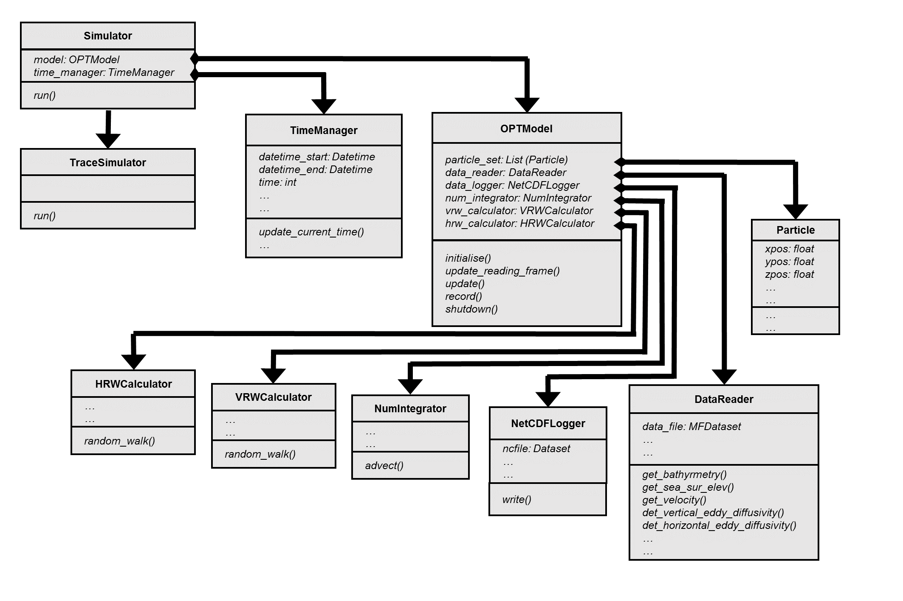
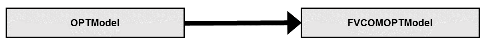
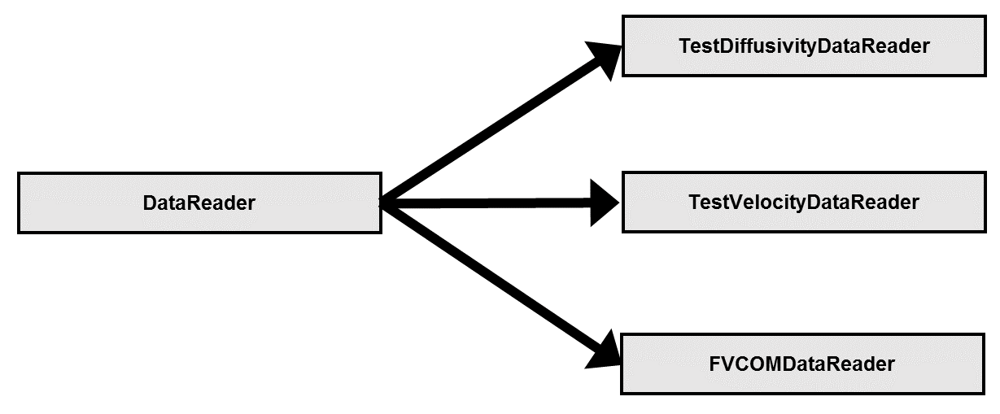

.. _overview:

Overview
========

.. _programming_language:

Programming language
--------------------

PyLag has been written in a mixture of **Python** and **Cython**. Python is an
interpreted, dynamic programming language that includes a large standard 
library. By using the standard library for operations such as reading and 
writing output files, parsing configuration files, or writing log files one
greatly reduces the amount of code that must be implemented from scratch. PyLag 
makes use of such standard applications wherever possible.

Because Python is dynamically typed, it tends to be slower that statically typed
languages such as C, C++ or Java. For this reason, performance critical sections
of PyLag's code are writting in Cython. Cython is a programming language that 
supports optional static type declarations. Cython modules are translated into
optimised C/C++ code which is then compiled as Python extension modules. If
calls to Python's API are minimised, the resulting code has performance
characteristics comparable with those of pure C/C++ code.

.. _code_design:

Code design
-----------

The main features of PyLag's code design are summarised in the UML diagram.
A brief description of the key elements is provided below.

Simulator
^^^^^^^^^

Simulators are relatively light weight objects that control the progression of
a simulation. TraceSimulator is a derived class that inherits from Simulator. It
is used for running simulations that trace the path taken by a set of
particles over a given period of time. All simulators possess a TimeManager,
which is used to help with time stepping and the writing of output to file; and
an Offline Particle Tracking Model (OPTModel).

TimeManager
^^^^^^^^^^^

TimeManagers are light weight objects that can be used to keep track of time
during a simulation.

OPTModel
^^^^^^^^

Objects of type OPTModel include methods to help with setting up and running
simulations. It is anticipated that data from different sources will require 
separate OPTModel objects that implement methods specific to the
grid on which the data is defined. For example, data may be 2D or 3D, and may
be defined on a structured or an unstructured grid. At present PyLag includes
a single example of this, which is a derived class for running particle
simulations based on output from the `Finite Volume Community Ocean Model (FVCOM) 
<http://fvcom.smast.umassd.edu/fvcom/>`_, which is an unstructured grid, finite 
volume, primitive equation model of the ocean's circulation.

Methods defined here include those for creating the initial particle set,
updating particle positions as a result of advection or diffusion, and writing
particle positions to file.

HRW- and VRWCalculator
^^^^^^^^^^^^^^^^^^^^^^

Horizontal Random Walk and Vertical Random Walk Calculators compute changes in 
a particle's position due to unresolved motions. Several different calculators 
are implemented in PyLag. The calculator to be used on a given run can be 
specified in a run configuration file. Factory methods are included which ensure
the correct calculator is created and returned.

NumIntegrator
^^^^^^^^^^^^^

Objects of type NumIntegrator compute changes in a particle's position due to 
resolved motions. At present, PyLag includes fourth-order Runga Kutta methods 
for advection in two and three dimensions.

NetCDFLogger
^^^^^^^^^^^^

NetCDFLoggers are relatively light weight objects that coordinate the writing of
data to file.

DataReader
^^^^^^^^^^

Objects of type DataReader are responsible for extracting field data from 
file(s). The interpolation of gridded field data to a given point in space
and time requires the use of interpolation procedures that are specific to
the type of grid (e.g. structured or unstructued) on which the data is defined. 
Thus, data readers tend to be specific to data sources. PyLag includes three
different data readers:

The first two are used for testing purposes, and don't actually read any data
from file; rather, they return field data computed from analytic formulae. The
third data reader is FVCOMDataReader, and it is used for extracting field data
from FVCOM output files.

Particle
^^^^^^^^

Objects of type Particle represent individual particles that have a given
position in space.